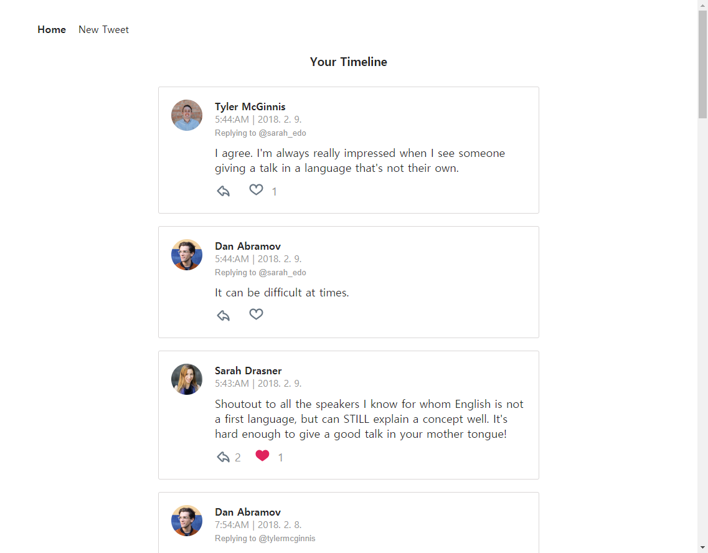
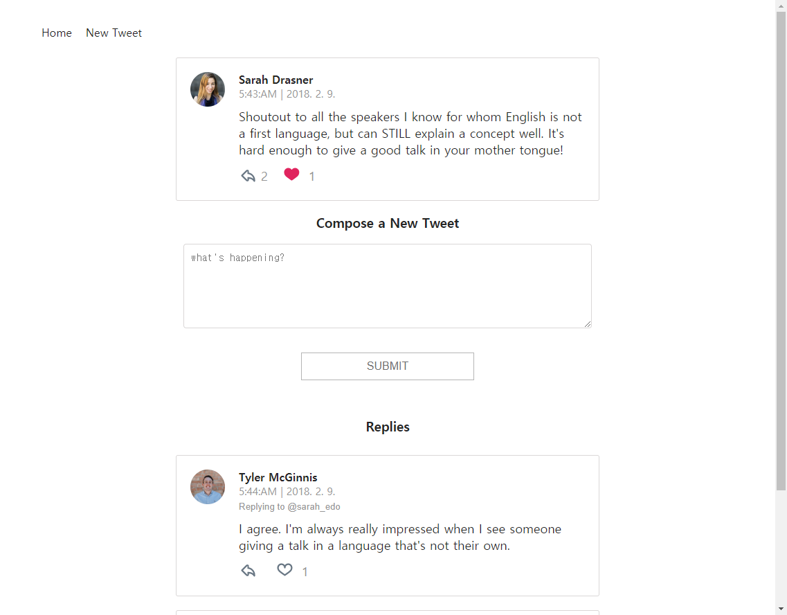

# ⚛Udacity React Nanodegree Chirper Project - tweets📚

This repo is a code-along with the first project in the [React Nanodegree program](https://www.udacity.com/course/react-nanodegree--nd019).

## 🔰Project Setup

- clone the Project - `git clone https://github.com/CaesiumY/reactnd-chirper.git`
- install the dependencies - `npm install`
- start a local server - `npm start`

## 📷Screenshots

    
Home

    

    
New Tweet

    

    
Tweet Page

    

## 👨‍💻Features

- Get a Tweet List
- Post a New Tweet
- View a Tweet Detail Page
- Redux loading bar
- Each tweets can have child or parent tweets(like comments)

## 📜License

[starter code](https://github.com/udacity/reactnd-chirper-app) from Udacity
